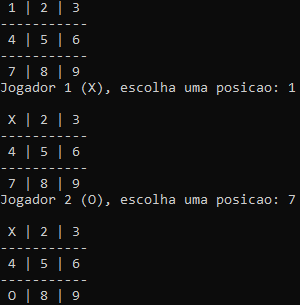

# Jogo-da-Velha-em-CPP

Um projeto de jogo da velha interativo para dois jogadores, feito em C++, utilizando o terminal em modo texto. Desenvolvido para entreter usuários, o objetivo é praticar o fluxo lógico e estruturas condicionais, manipulação e validação de entradas do usuário, e gerenciamento dinâmicos de estado do jogo.

## Demonstração

Interface do Jogo da Velha em execução no terminal

## Instalação e Pré-requisitos

### Pré-requisitos

- Compilador C++ compatível com **C++11 ou superior** (ex.: `g++`, `clang++`)
- Terminal ou prompt de comando para executar o programa

### Passos
